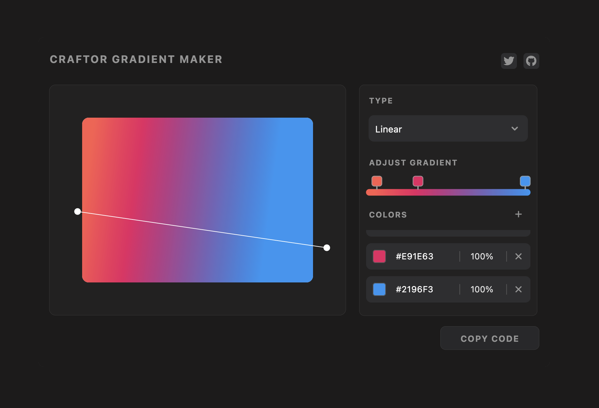

# Craftor Gradient Maker

The Gradient Generator for Flutter is an open-source project that provides an easy-to-use interface for generating gradients in Flutter applications. With this tool, users can quickly create three types of gradients: radial, linear, and sweep, without the need for manual coding. Additionally, users can copy the generated gradient code with just a click of a button, saving development time and effort.

## Screenshot

## Features

- Generate Radial, Linear, and Sweep Gradients: Choose from a variety of gradient types to suit your UI design needs.

- Copy Code with Ease: Save time and eliminate manual errors by copying the generated gradient code directly to your clipboard with a single click.

## Contributing

This project is written with a focus on speed and functionality. As a result, the code may not be optimally organized or follow best practices. I welcome contributions from the community to improve the project's codebase.

If you have any suggestions, feature requests, or bug reports, please open an issue on the [GitHub repository](https://github.com/use-craftor/craftor_gradient_maker/issues).

To contribute to the project, follow these steps:

1. Fork the repository to your GitHub account.
2. Create a new branch from the `main` branch.
3. Make your changes and improvements.
4. Test thoroughly.
5. Commit your changes and push them to your forked repository.
6. Create a pull request to the original repository's `main` branch.

## License

The Gradient Generator for Flutter is open-source and distributed under the [MIT License](https://opensource.org/licenses/MIT).

## Acknowledgments

**Note:** This project is maintained by @Ansh-Rathod, and as such, it might not be actively developed or fully feature-complete. However, i encourage the community to get involved and provide feedback, suggestions, and bug reports to help make this project even better. Happy coding!
